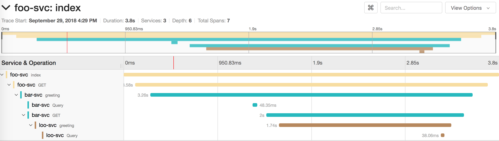
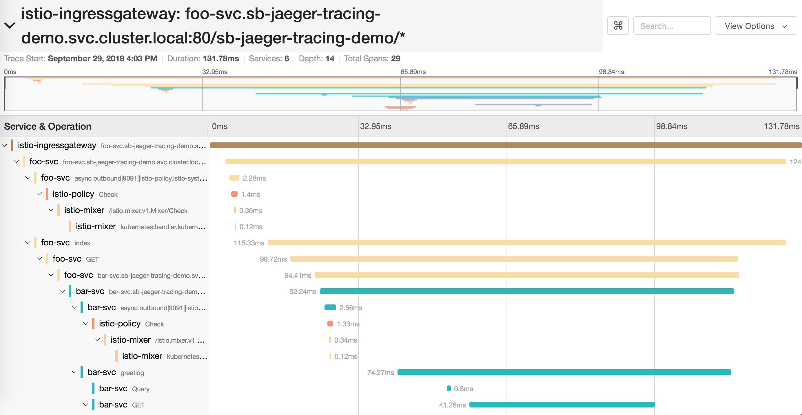

# spring-boot-istio-jaeger-demo

Spring Boot项目利用Jaeger做分布式Tracing的例子。

## 项目介绍

这个项目一共有3个service：`foo-svc`、`bar-svc`、`loo-svc`。它们的调用链如下：

1. foo-svc 调用 bar-svc
   1. bar-svc 调用 redis
   1. bar-svc 调用 h2
   1. bar-svc 调用 loo-svc
      1. loo-svc 调用 redis
      1. loo-svc 调用 h2  

## 例子一：本地运行

本地运行的方法很简单

1. cd到本项目所在目录，执行`docker-compose up`就行了。
1. 访问foo-svc：`curl http://localhost:8080`
1. 查看Jaeger结果：[http://localhost:16686/](http://localhost:16686/)

如果正常启动，你会看到这样的结果；



**关于Redis的Tracing**

目前[opentracing java-spring-jaeger][opentracing java-spring-jaeger]还没有提供`spring-data-redis`的Auto Configuration，因此需要自己引入[opentracing java-redis-client][opentracing java-redis-client]项目。

本例子是使用`BeanPostProcessor`来instrument的，见`RedisConnectionFactoryBeanPostProcessor.java`：

```java
@Component
public class RedisConnectionFactoryBeanPostProcessor implements BeanPostProcessor {

  private Tracer tracer;

  public RedisConnectionFactoryBeanPostProcessor(Tracer tracer) {
    this.tracer = tracer;
  }

  @Override
  public Object postProcessAfterInitialization(Object bean, String beanName) throws BeansException {
    if (bean instanceof RedisConnectionFactory) {
      return new TracingRedisConnectionFactory((RedisConnectionFactory) bean, false, tracer);
    }
    return bean;
  }

}
```

不过对[opentracing java-redis-client][opentracing java-redis-client]的源代码观察发现，似乎并不是`RedisConnection`和`ReactiveRedisConnection`的所有操作都会做tracing。
特别是`ReactiveRedisConnection`，几乎所有操作都没有做tracing（写本文是[opentracing java-redis-client][opentracing java-redis-client]版本0.0.8）。

**清理**

执行`docker-compose down`

## 例子二：运行在已经安装了Istio的K8S中

**前置要求**

1. 首先你得有一个K8S集群
1. [安装了Istio][k8s-learn-istio-install]
1. 并且这个Istio启用了Jaeger
1. 把`istio-system`下的`jaeger-query` Service暴露出来能够从集群外访问

**运行步骤**

1. cd到本项目的`k8s`目录
1. 把`06-foo-ingress.yaml`里的`<hostname>`改成你自己的域名（你也可以自行配置，如果你没有域名那自行查询文档解决）
1. 然后到`k8s`目录下，执行`kubectl apply -f .`
1. 本例子给了两种暴露`foo-svc`方法：
   1. 通过nginx ingress暴露：`curl http://ingress-test.<hostname>/sb-jaeger-tracing-demo/`
   1. 通过Istio Gateway暴露：`curl http://istio-test.<hostname>/sb-jaeger-tracing-demo/`
1. 访问`jaeger-query`

正常来说，你会发现通过nginx ingress访问的时候并不记录tracing（见[Issue #7963][istio-issue-7963]）。只有通过Istio Gateway访问的时候才会记录tracing，大致样子如下：



你会发现比起本地运行的tracing多了很多层级，刨除istio相关component的tracing，大体上和本地运行的tracing差不多，但是多了一些层级。
这些多出来的层级是由于istio自动注入的envoy sidecar产生的。

注意在`01-namespace.yaml`里的这段配置：`JAEGER_UDP_SENDER_HOST: jaeger-agent.istio-system.svc.cluster.local`，这个是istio的jaeger-agent的cluster DNS name。

**清理**

到`k8s`目录下，执行`kubectl delete -f .`

## 环境变量

本项目提供了几个环境变量，你可以根据自己的实际情况修改

| Environment Variable             | Default Value         | Belong Service      | Description |
|----------------------------------|-----------------------|---------------------|-------------|
| `BAR_SVC_URL`                    | `http://bar-svc:8080` | `foo-svc`           |             |
| `LOO_SVC_URL`                    | `http://loo-svc:8080` | `bar-svc`           |             |
| `SERVER_PORT`                    | `8080`                | all                 |             |
| `REDIS_HOST`                     | `redis`               | `bar-svc` `loo-svc` |             |
| `REDIS_PORT`                     | `6379`                | `bar-svc` `loo-svc` |             |
| `JAEGER_UDP_SENDER_HOST`         | `localhost`           | all                 |             |
| `OPENTRACING_SPRING_WEB_ENABLED` | `true`                | all                 | 是否为spring web开启opentracing |

## 使用的开源项目

其实本项目没有做什么事情，都是使用了开源项目来利用Jaeger做tracing的，相关的项目如下：

* [OpenTracing Java][opentracing-java]
* [OpenTracing java-spring-jaeger][opentracing java-spring-jaeger]
  * [OpenTracing java-spring-web][opentracing java-spring-web]
  * [OpenTracing java-spring-cloud][opentracing java-spring-cloud]
* [更多OpenTracing java instrumentation][opentracing java]
* [OpenTracing Tutorial - Java][opentracing-tutorial-java]


[k8s-learn-istio-install]: https://github.com/chanjarster/k8s-learn/tree/master/addons-guide/istio/install
[opentracing java-spring-jaeger]: https://github.com/opentracing-contrib/java-spring-jaeger
[opentracing java-spring-web]:https://github.com/opentracing-contrib/java-spring-web
[opentracing java-spring-cloud]:https://github.com/opentracing-contrib/java-spring-cloud
[opentracing java]: https://github.com/opentracing-contrib?utf8=%E2%9C%93&q=&type=&language=java
[opentracing-tutorial-java]: https://github.com/yurishkuro/opentracing-tutorial/tree/master/java
[istio-issue-7963]: https://github.com/istio/istio/issues/7963
[opentracing-java]: https://github.com/opentracing/opentracing-java
[opentracing java-redis-client]: https://github.com/opentracing-contrib/java-redis-client
